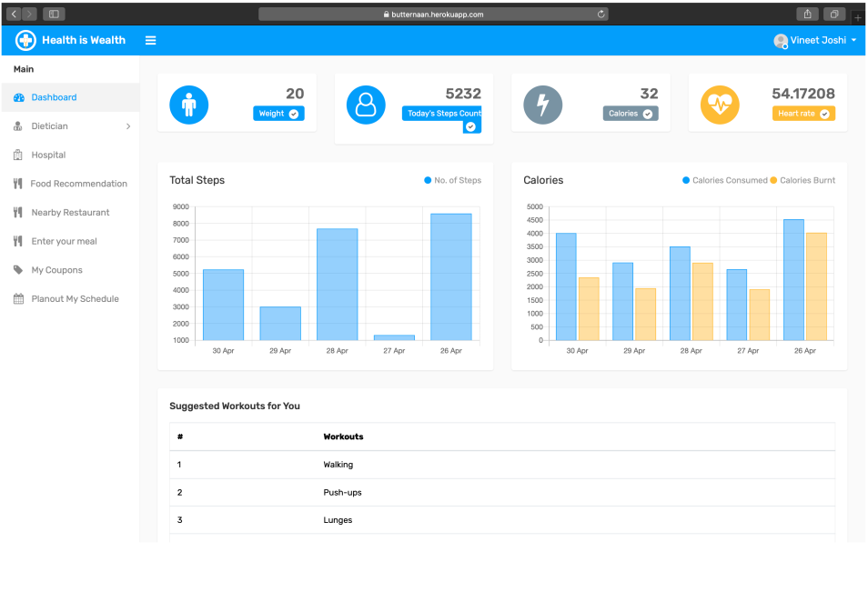
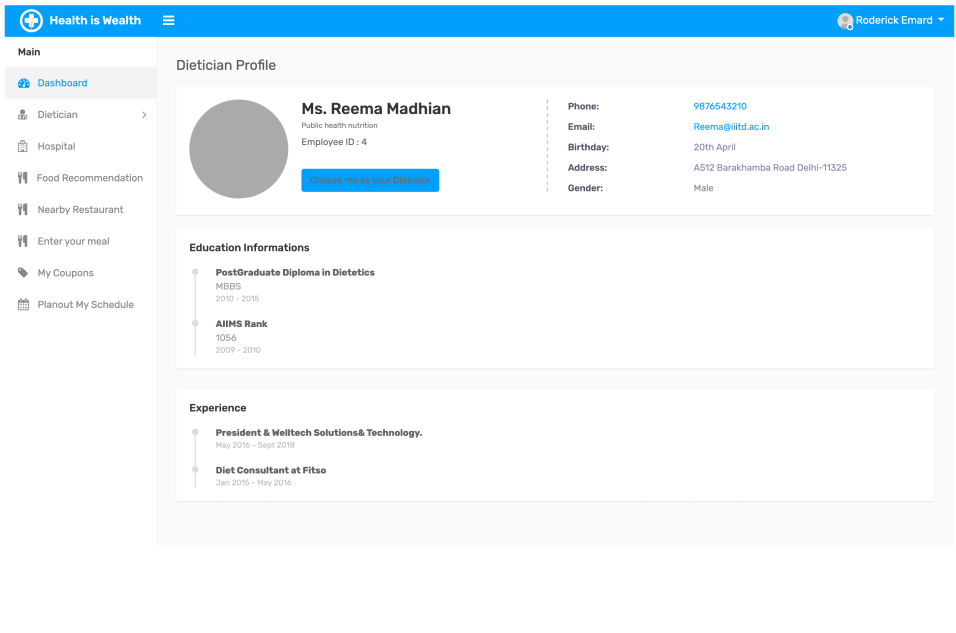
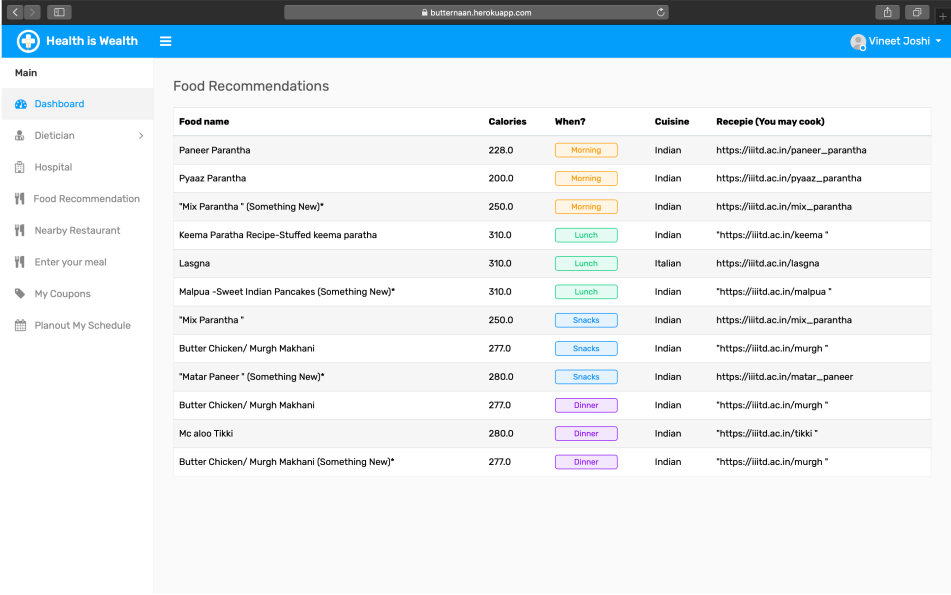
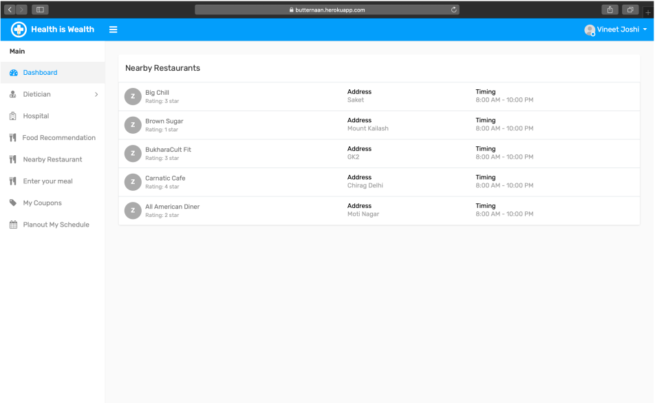
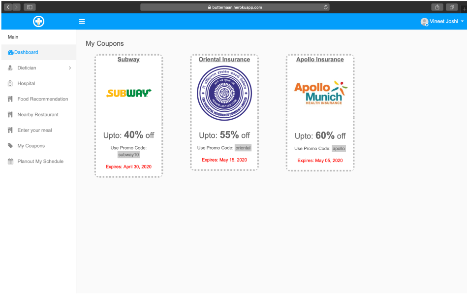
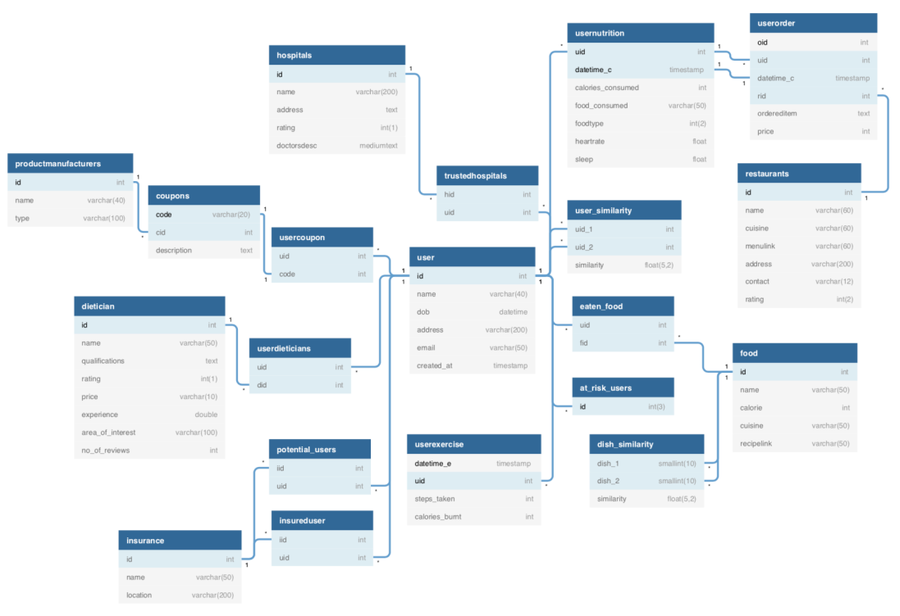

# Fit.io

A platform which constantly keeps track of user calorie intake and appropriately suggests various meals, while incentivizing a healthy lifestyle by providing coupon discounts for various fitness products and by various insurance companies.
Keeping track of the user’s daily calorie intake
Keeping track of the user's daily physical activity and workouts using your mobile sensors, or by synchronizing with your fitness band/smartwatch.
Suggest food recommendations based on the user’s daily calorie intake
Suggest workout regimens based on daily user physical activity
Link user account, and share daily lifestyle statistics with your dietician’s account to directly receive feedback about your current calorie intake, and suggestions regarding your workout regimen.
Link daily activities and intake trends to medical record
Closely monitor at-risk patients and direct feedback their data to a hospital approved by the user, where the hospital will deploy emergency services in case of unprecedented irregularities.

**Project selected by instructor(Dr. Mukesh Mohania) for bonus**

## Screenshots

## ER Diagarm

 
For more details, please refer to Project Report.pdf